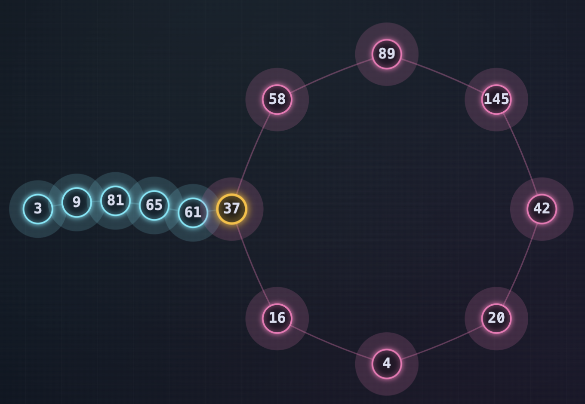
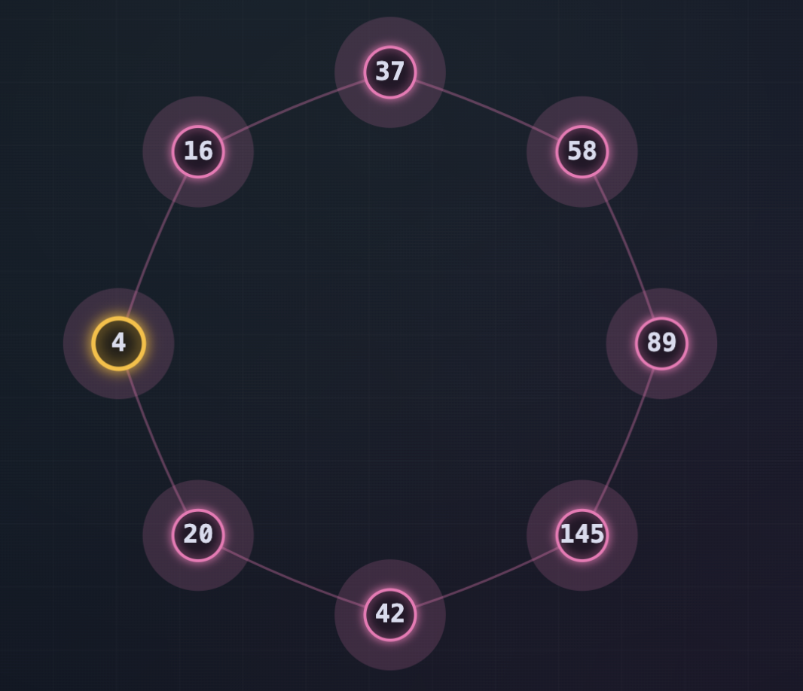
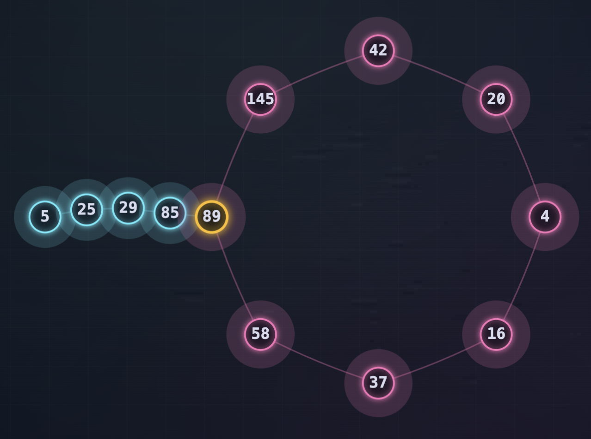
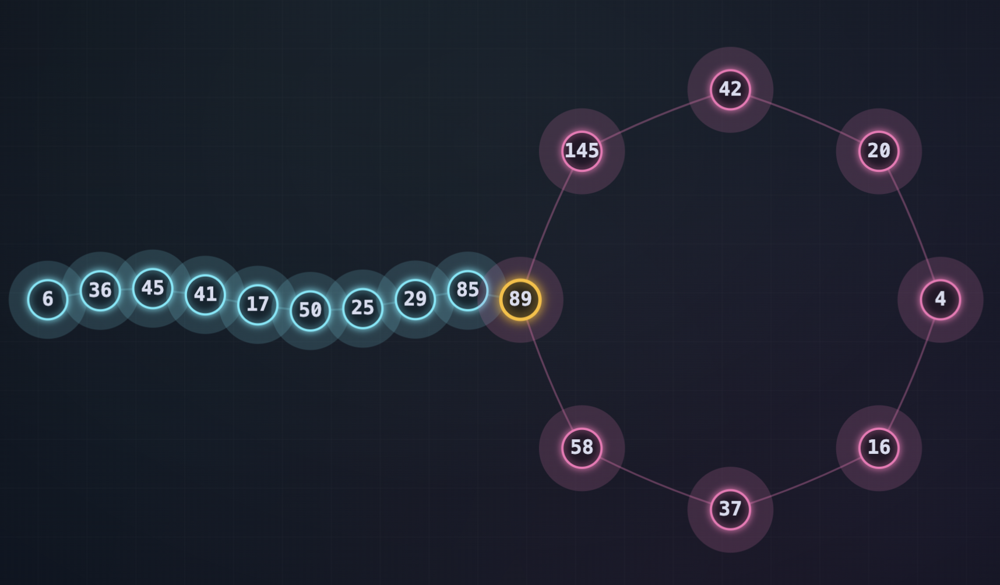

# Números Felizes e Infelizes

No ano passado, Fran Ruda (Deus o tenha em sua glória) nos desejou um **feliz 2025 muito matemático**. Ele nos deu dados fascinantes sobre este ano. Para honrar seu legado, me coloquei a buscar curiosidades sobre 2026.

E descobri algo que eu não sabia: na **teoria dos números** (o ramo da matemática que estuda as propriedades dos números inteiros) existem números que são chamados de **felizes** e outros que são chamados de **infelizes**.

## Como funciona?

O processo é simples:

1. **Pegue qualquer número**
2. **Separe seus dígitos** e eleve cada um ao quadrado
3. **Some todos esses quadrados** para obter um novo número
4. **Repita o processo** com o número resultante

Se eventualmente você chegar ao **1**, o número original é **feliz** 😊

Se você ficar preso em um **ciclo infinito** sem chegar ao 1, o número é **infeliz** 😔

Vamos ver isso em ação com alguns exemplos:

## O Número 2: Um Exemplo Infeliz

Deixe-me mostrar com um exemplo. Vamos começar pelo número **2**:

- 2² = **4**
- 4² = **16**
- 1² + 6² = 1 + 36 = **37**
- 3² + 7² = 9 + 49 = **58**
- 5² + 8² = 25 + 64 = **89**
- 8² + 9² = 64 + 81 = **145**
- 1² + 4² + 5² = 1 + 16 + 25 = **42**
- 4² + 2² = 16 + 4 = **20**
- 2² + 0² = 4 + 0 = **4**

E aqui o que notamos? **Voltamos ao 4**. Forma-se um ciclo infinito sem escapatória.

**Não há nada mais triste do que estar condenado a repetir a mesma coisa até o infinito** (como [o mito de Sísifo](https://en.wikipedia.org/wiki/The_Myth_of_Sisyphus)). Por isso chamamos o **2** de **número infeliz**.

_Pensem em nossos usuários quando ficam presos em um loop infinito... existe algo mais infeliz que isso?_

Se testarmos com outros números, veremos que a maioria segue o mesmo padrão: avançam por uma cadeia de transformações até que chegam ao **4**, ficando presos em um ciclo eterno.

## Mais Exemplos de Números Infelizes

Vamos ver o que acontece com os números **3**, **4**, **5** e **6**:

### O Número 3

- 3² = **9**
- 9² = **81**
- 8² + 1² = 64 + 1 = **65**
- 6² + 5² = 36 + 25 = **61**
- 6² + 1² = 36 + 1 = **37**
- 3² + 7² = 9 + 49 = **58**
- 5² + 8² = 25 + 64 = **89**
- 8² + 9² = 64 + 81 = **145**
- 1² + 4² + 5² = 1 + 16 + 25 = **42**
- 4² + 2² = 16 + 4 = **20**
- 2² + 0² = 4 + 0 = **4**

Mais uma vez chegamos ao **4**! O 3 também é **infeliz**.

### O Número 4

- 4² = **16**
- 1² + 6² = 1 + 36 = **37**
- 3² + 7² = 9 + 49 = **58**
- 5² + 8² = 25 + 64 = **89**
- 8² + 9² = 64 + 81 = **145**
- 1² + 4² + 5² = 1 + 16 + 25 = **42**
- 4² + 2² = 16 + 4 = **20**
- 2² + 0² = 4 + 0 = **4**

O **4** encontra a si mesmo no ciclo. É o coração do loop infinito. **Infeliz**, é claro.

### O Número 5

- 5² = **25**
- 2² + 5² = 4 + 25 = **29**
- 2² + 9² = 4 + 81 = **85**
- 8² + 5² = 64 + 25 = **89**
- 8² + 9² = 64 + 81 = **145**
- 1² + 4² + 5² = 1 + 16 + 25 = **42**
- 4² + 2² = 16 + 4 = **20**
- 2² + 0² = 4 + 0 = **4**

Mais uma vez, todos os caminhos levam ao **4**. O 5 é **infeliz**.

### O Número 6

- 6² = **36**
- 3² + 6² = 9 + 36 = **45**
- 4² + 5² = 16 + 25 = **41**
- 4² + 1² = 16 + 1 = **17**
- 1² + 7² = 1 + 49 = **50**
- 5² + 0² = 25 + 0 = **25**
- 2² + 5² = 4 + 25 = **29**
- 2² + 9² = 4 + 81 = **85**
- 8² + 5² = 64 + 25 = **89**
- 8² + 9² = 64 + 81 = **145**
- 1² + 4² + 5² = 1 + 16 + 25 = **42**
- 4² + 2² = 16 + 4 = **20**
- 2² + 0² = 4 + 0 = **4**

Depois de um caminho mais longo, o 6 também termina preso no **4**. **Infeliz**.

## O Número 7: A Primeira Surpresa

Mas então chegamos a um número mágico: o **7**.

- 7² = **49**
- 4² + 9² = 16 + 81 = **97**
- 9² + 7² = 81 + 49 = **130**
- 1² + 3² + 0² = 1 + 9 + 0 = **10**
- 1² + 0² = 1 + 0 = **1**
- 1² = **1**

Chegou a um final! Alcançamos o **1** e o ciclo se rompeu. Por isso chamamos o **7** de **número feliz**. Pode descansar no 1, sem loops infinitos e com o prazer de ter cumprido com seu dever.

---

## E o 2026?

Agora, o que acontece com o **2026**? Vamos ver:

- 2² + 0² + 2² + 6² = 4 + 0 + 4 + 36 = **44**
- 4² + 4² = 16 + 16 = **32**
- 3² + 2² = 9 + 4 = **13**
- 1² + 3² = 1 + 9 = **10**
- 1² + 0² = 1 + 0 = **1**
- 1² = **1**

Acontece que o **2026** efetivamente é um número feliz! 🎉

## Moral da História

Equipe, desejo que vocês tenham um 2026 tão feliz quanto o número 2026. E tomara que este ano, possamos fechar e cumprir com todas as coisas que queremos e não fiquemos presos em um loop infinito. Que o que começarmos, terminemos.

Abraço e feliz 2026 feliz!
Pasti

---

**P.S.:** Quer testar com outros números? Você pode brincar com a visualização interativa aqui: https://andresdambrosio.github.io/happy_numbers/
